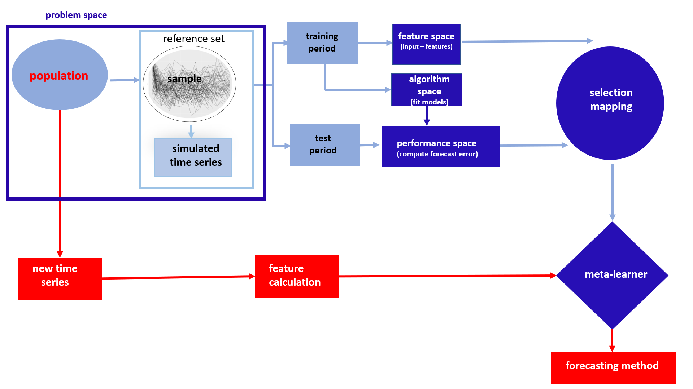

```{r setup, include=FALSE}
knitr::opts_chunk$set(echo = FALSE, message=FALSE, cache=FALSE)
# Load any R packages you need here
library(forecast)
library(ggplot2)
```

# Introduction {#ch:intro}

\epigraph{Essentially, all models are wrong, but some are useful.}{--- \textup{George E. P. Box}, 1987}

The words of famous British statistician George Box encapsulate the essence of model selection.  This statement is particularly valid for forecast model selection. For many decades, researchers have been developing increasingly sophisticated 
models for forecasting. From a theoretical and computational point of view, these models are elegant and efficient algorithms, which makes them appealing candidates for many applications. However, given the large number of models, it is challenging to identify which one is likely to generate the most accurate forecasts for a given time series. Even though various models for time series forecasting have been developed, little research has contributed to advice on when each model is beneficial. Moreover, as stated by @georgoff1986manager, the main issue facing forecasters is not the need for new or more sophisticated models, but the need to derive better approaches for forecast model selection.  Since a trial-and-error approach is an extremely time consuming search process, researchers need to identify more efficient search strategies. The aim of this thesis is to develop new frameworks that will help in forecasting large numbers of time series completely automatically. 
 

## Background of the study


The advent of modern technologies has enabled businesses and companies to collect ever more data. Of these, time series data are everywhere and play a key role in business decision-making processes.  For example, large-scale businesses, such as Facebook [@taylor2018forecasting] and Walmart [@seaman2018considerations], need to forecast many millions of time series for capacity planning to optimise resource allocation, set targets to evaluate performance relative to baseline, and so on.  Hence, accurate forecasts for these series are immensely valuable.  The brute force solution is simply to try out all the candidate models on the problem at hand and select the model that performs best over the test period. This model is then used to forecast future values of the time series. However, this approach is not feasible in practice, especially when there are tens or hundreds of millions of series to forecast. The alternative solution is 'aggregate selection', in which a single method is used to compute forecasts for all time series [@fildes1989evaluation]. According to the no-free-lunch concept, there is no single model that performs best on all kinds of time series [@wolpert1997no].  Since neither solution is ideal, there is a need for a more general and flexible framework to assist in forecasting large numbers of time series.

In an attempt to answer the question 'Which forecast model performs best on a given series?', Spyros Makridakis organised the Makridakis Competitions, also known as M-Competitions. The M-Competitions have had a profound influence on the field of time series forecasting [@hyndman2019brief].  The findings of these competitions also point to many important
research directions and conclusions [@makridakis2001response]. Of these, two are particularly important for the problem addressed by this thesis. First, the characteristics of time series are useful for identifying suitable models for forecasting [@armstrong2001s; @tashman2001m3]. Second, forecasters should be able to explain the conditions under which each method works best [@hyndman2001s; @makridakis2001response]. To this end, this thesis investigates the utility of the characteristics of time series referred to as *features* in addressing the problem of large-scale time series forecasting. Feature-based analysis of time series has several advantages over raw point analysis: it facilitates data visualisation and understanding; it acts as a dimension-reduction tool, thereby reducing storage requirements and computational time; it handles time series with unequal lengths [@guyon2003introduction]; among others.


A few researchers have explored the benefit of using time series features to select suitable forecasting methods.  @collopy1992rule introduced 99 rules based on 18 features of time series to make forecasts for economic and demographic time series. @meade2000evidence uses 25 features of time series to predict the relative performance of nine different models.  @petropoulos2014horses examine the effect of seven time series features (seasonality, trend, cycle, randomness, length, inter-demand interval and coefficient of variation) on predicting the performance of 14 popular models through regression analysis. The authors argue for a 'horses for courses' approach to  discovering the extent to which the features of time series are useful in predicting the model performance. In an attempt to answer the question raised by @hyndman2001s in the M3 competition discussion 'why some methods work well and others do not' @kang2017visualising try to visualise the algorithm performance in the instance space defined by six features. A more detailed description of the literature is given in Chapter \ref{ch:paper2}.


Although many researchers have highlighted the usefulness of features in forecast model selection, only a few studies have reported success against benchmarks and other commonly used approaches in forecasting.  Revisiting this literature reveals significant gaps. Possible reasons for these gaps are i) an inadequate number of features were used; ii) the selected features were not useful for the purpose; iii)  possible limitations in the modelling framework used (for example, linear regression models that focus on the global relationship in the data do not incorporate local relationships into the model); and iv) a lack of diversity in the training set of time series used to build the model. In this thesis, the aim is to design feature-based time series forecasting algorithms for large-scale applications and fill in the noticeable gaps in the literature.


## Meta-learning

The feature-based forecast algorithms proposed in Chapters \ref{ch:paper2}, \ref{ch:paper4} and \ref{ch:paper5} are based on a meta-learning approach.
A framework for algorithm selection was first proposed in the seminal paper of @rice1976. Rice's algorithm selection framework builds a mapping that relates the features of the problem instances with the performance of different algorithms. The machine-learning community use the same idea, calling it 'meta-learning'. Although Rice's idea has been around since 1976, not many applications using his idea have been made until recently. However, with the rapid development of information technologies and the emergence of an era of big data, Rice's algorithm selection problem has attracted the attention of many disciplines and provides a promising solution to algorithm selection problems in various domains.  @smith2009cross provides a comprehensive review of applications of this approach. However, despite its widespread popularity, several researchers have pointed out that it is not entirely clear from Rice's framework how the mapping is done from features to  performance of different algorithms. The work was later extended and improved in a few different ways  [@smith2012measuring; @kotthoff2016algorithm]. The methodological framework used in this study is shown in Figure \ref{fig:frameworkch1}. The offline and online phases are shown in blue and red respectively. A meta-learner is trained during the offline phase and is then used to select an appropriate model for a new time series in the online phase. The success of a meta-learning framework depends on four main factors: i) problem space, ii) feature space, iii) algorithm space and iv) performance space. These are now described in detail.


```{r frameworkch1, fig.cap="The methodological framework. The offline phase is shown in blue and the online phase in red.", out.width="105%", fig.align='center', out.height="40%", fig.pos="h"}

```

### Problem space

The dataset used for the study is called the problem space. In this thesis, the time series of M1, M3 [@makridakis2000m3] and M4 competitions [@makridakis2018m4] form the problem space. \textcolor{black}{The M-competition data were a sample of time series collected from several domains such as demographics, finance, business and economics.} \autoref{mcomp} \textcolor{black}{shows the classification of the M-competition series according to frequency and domain.} A single time series is called *an instance* in the problem space. Prediction accuracy of a meta-learner strongly depends on the instances used to train the meta-learner. In addition to the time series from the M-Competitions, simulated time series are used to increase the diversity of the problem space.  The different approaches used to simulate time series are explained in Chapters \ref{ch:paper2}, \ref{ch:paper3} and \ref{ch:paper5}. Further, it is important to note that instances are required that are similar to the time series that are forecasted in the online phase of the algorithm. 


\begin{table}[!h]
\centering\scriptsize\tabcolsep=0.12cm
\caption{The composition of M-competition data: the number of time series by domain and frequency category}
\label{mcomp}
{\color{black}\begin{tabular}{l|c|rrrrrr|r|}
\hline
\multirow{2}{*}{Period} & \multicolumn{8}{c|}{Domain} \\ \cline{2-9} 
                  &Competition &Demographic  & Finance  & Industry  & Macro  & Micro & Other &  Total\\ \hline
\multirow{3}{*}{Yearly}& M1 & 30  & -  & 35  & 59 & 57  & - & 181 \\ 
                  & M3  & 245  &  58 &  102 & 83 &146  &  11&645  \\ 
                  & M4 &  1088 &  6519 &  3716 &  3903& 6538 &1236  & 23000 \\ \hline
\multirow{3}{*}{Quarterly}& M1 &  39 &  - & 18  & 104 & 42 &  -&  203\\ 
                 & M3  & 57  &  76 &  83 &  336&  204&  -&  756\\ 
                 & M4 & 1858  & 5305  & 4637  &5315  &  6020& 865 & 24000 \\ \hline
\multirow{3}{*}{Monthly}& M1 &  75 & -  & 183  & 156 & 203 & - &  617\\ 
                 & M3 & 111  & 145  & 334   & 312 & 474 & 52  & 1428 \\  
                 & M4 & 5728  & 10987  & 10017  & 10016 & 10975 & 277 & 48000 \\ \hline
Weekly           & M4 &  24 &  164 &  6 & 41 & 112 & 12 & 359 \\ 
Daily            & M4 & 10  & 1559  &  422 & 127 & 1476 & 638 & 4227 \\ 
Hourly           & M4 &  0 &0   & 0  &  0&  0&  414&  414\\ \hline
\end{tabular}}
\end{table}


### Feature space

The feature space is characterised by a set of measurable characteristics of the instances in the problem space. The features can also be considered summary statistics of time series. John W. Tukey was the first to come up with the idea of 'features', which he called cognostics: computer aided diagnostics [@tukey1988computer]. A few decades later, his idea was rebranded and used under different names. A broad range of features exists that can be used to summarise time series [@fulcher2014highly]. The choice of features should take account of the final goal of the research question. Further, features of time series play a central role in both online and offline phases of the meta-learning framework. These constraints introduce the need for careful consideration of the feature selection process in the frameworks. The following properties of features are considered:

i) Informative. Most of the features introduced in the literature aim to identify different patterns in time series. In contrast in this thesis, the interest is in using features to identify the best forecasting model(s) for a given series. Hence, the features considered should provide sufficient distinction between different instances in terms of which is the most suitable model(s) for forecasting.

ii) Interpretability. The features used should provide meaningful interpretations of the instance characteristics so that practitioners can gain maximum insight into the problem space. Further, this helps explain reasons for the predictions of the meta-learner and gain trust in the proposed frameworks.  

iii) Time and computational cost. Features play a central role in both offline and online phases of the algorithm. To make predictions quickly during the online phase, the features considered should be easy and quick to compute without heavy computational cost. 

iv) Applicability. Features should be computable for a broad range of problem instances, rather than being restricted by different conditions, such as length, non-stationarity and other properties of time series. 

Further, apart from a few exceptions (such as length of series, number of times the time series crosses the median and the number of flat spots in the series), most of the features considered here are independent of scale and are ergodic: asymptotically independent of the length of the time series. A more detailed description of the features is given in Chapters \ref{ch:paper2}, \ref{ch:paper3} and \ref{ch:paper4}.


### Algorithm space

A suitable set of candidate models to include in the portfolio forms the algorithm space. In this thesis twelve methods implemented in the `forecast` package in R [@forecast] are considered for the algorithm space.  This is the first time such a large collection of algorithms has been considered in a time series meta-learning framework. The algorithm space includes (The R functions are given in parentheses):


  i) Random walk with drift (`rwf` with drift=TRUE)
  ii) Random walk model (`rwf` with drift=FALSE)
  iii) Seasonal naive (`snaive`)
  iv) White noise process 
  v) Theta method (`thetaf`) -- this method became the winner of the M3 competition [@makridakis2000m3]
  vi)  TBATS (`tbats`) models introduced by @de2011forecasting
  vii) Neural network forecasts (`nnetar`)
  viii) automated ARIMA algorithm (`auto.arima`)
  ix) exponential smooting (ETS) algorithm (`ets`)
  x) STL-AR (`stlm` with model function `ar`) -- seasonal and trend decomposition using loess with autoregressive (AR) modelling of the seasonally adjusted series
  xi) MSTL-ETS (`mstl` with model function `ets`) -- first, a multiple seasonal decomposition is applied to the time series and then the seasonal naive is used to forecast the seasonal components; then, the automated ETS algorithm  is used to forecast the seasonally adjusted series.
  xii) MSTL-ARIMA (`mstl` with model function `auto.arima`) -- first, a multiple seasonal decomposition is applied to the time series and then the seasonal naive is used to forecast the seasonal components; then, the automated ARIMA algorithm is used to forecast the seasonally adjusted series.
    
    
The methods considered in viii)-xii), involve fully or partially use of the automated ARIMA algorithm of @Hyndman2008 or the automated ETS algorithm of @Hyndman2002 to select the appropriate either ARIMA class model or ETS models. Next, the main steps of these algorithms are summarised.


#### Automated exponential smoothing (`ets`)
Exponential smoothing methods were introduced in the late 1950s [@Brown59; @Brown63]. This framework was later extended by @gardner1985exponential and @Hyndman2002. Because of their computational simplicity and interpretability, they became widely used in practice. A classification of 15 exponential smoothing methods is presented in \autoref{table1}. Each model can have an additive or multiplicative error, giving 30 different models. Out of these 30 models, only 19 models are numerically stable. Further, multiplicative trend models give poor forecasts, which leaves 15 models.
\begin{table}[!htp]
\centering
\caption{Classification of exponential smoothing methods}
\label{table1}
\begin{tabular}{l|ccc}
\hline
\multirow{2}{*}{Trend component} & \multicolumn{3}{c}{Seasonal Component} \\ \cline{2-4} 
                  &   N (None)    &  A (Additive)     &   M (Multiplicative)    \\ 
 N (None)                 &   N, N    &   N, A    &   N, M    \\ 
 A (Additive)                &   A, N    &   A, A    &  A, M     \\ 
 $A_d$ (Additive damped)                &  A$_d$, N     &   A$_d$, A    &    A$_d$, M   \\ 
  M (Multiplicative)                &   M, N    &    M, A   &    M, M   \\ 
  $M_d$ (Multiplicative damped)                &    M$_d$, N   &  M$_d$, A     & M$_d$, M      \\ \hline
\end{tabular}
\end{table}
The steps involved are summarised below [@Hyndman2008]:

1. For each series, apply each of the 15 models that are appropriate for the data.

2. For each model, optimise the parameters (smoothing parameters and initial values for the states) using maximum likelihood estimation.

3. Select the best model using the corrected Akaike's Information Criterion (AICc) and produce forecasts using the best selected model.

#### Automated ARIMA modelling (`auto.arima`)

ARIMA is one of the most popular models for time series forecasting. One of the common difficulties in ARIMA modelling is the order selection process. @Hyndman2008 developed a framework to automate this process. The steps involved are summarised below:
For non-seasonal data, ARIMA$(p, d, q)$ models are considered and for seasonal data ARIMA$(p, d, q)(P, D, Q)_m$ are considered.

1. Select the number of differences $d$ and $D$ via unit root tests.

2. Try four possible models to start with:

i) ARIMA$(2, d, 2)$ if $m=1$ and ARIMA$(2, d, 2)(1, D, 1)_m$ if $m > 1$.
ii) ARIMA$(0, d, 0)$ if $m=1$ and ARIMA$(0, d, 0)(0, D, 0)_m$ if $m > 1$.
iii) ARIMA$(1, d, 0)$ if $m=1$ and ARIMA$(1, d, 0)(1, D, 0)_m$ if $m > 1$.
iv) ARIMA$(0, d, 1)$ if $m=1$ and ARIMA$(0, d, 1)(0, D, 1)_m$ if $m > 1$.

3. Select the model with the smallest AICc from step 2. This becomes the current model.

4. Consider up to 13 variations on the current model:

i) Vary one of $p$, $q$, $P$ and $Q$ from the current model by $\pm$ 1.
ii) $p$, $q$ both vary from the current model by $\pm$ 1.
iii) $P$, $Q$ both vary from the current model by $\pm$ 1.
iv) Include or exclude the constant term from the current model.
Repeat step 4 until no lower AICc can be found. For more details, please refer to @Hyndman2008. 


### Algorithm performance space

Algorithm performance space is characterised by a set of metrics used to evaluate the performance of different algorithms on the instances in the problem space. Mean absolute scaled error (MASE) introduced by @hyndman2006another is mainly used throughout the thesis for evaluate point forecasts. Let $y_t$ and $\hat{y}_t$ denote the observed  and forecast values at time $t$, respectively. Then, MASE is defined by

$$\text{MASE}=\frac{\frac{1}{H}\sum_{h=1}^H |y_{T+h}-\hat{y}_{T+h|T}|}{\frac{1}{n-m}\sum_{t={m+1}}^{T}|y_t - y_{t-m}|}.$$

where $H$ is the length of the forecast horizon, $T$ is the length of the training period of the time series and $m$ is the frequency of the time series. The MASE is independent of the scale of the data. In addition to MASE, symmetric mean absolute percentage error (sMAPE) is used in Chapter \ref{ch:paper3} and Chapter \ref{ch:paper4} because the M4 competition forecasts are evaluated based on both MASE and sMAPE [@M4compguide]. The sMAPE is simply

$$\text{sMAPE}=\frac{1}{H}\sum_{h=1}^H\frac{200|y_h-\hat{y}_h|}{|y_h|+|\hat{y}_h|}.$$

Prediction intervals are also computed. The performance of 95\% prediction intervals are evaluated based on the mean scaled interval score (MSIS) [@gneiting2007strictly; @M4compguide]. The MSIS is defined as 

$$\text{MSIS} = \frac{\frac{1}{H}\sum_{h=1}^{H}(U_h-L_h)+40(L_h-y_h)1\{y_h<L_h\}+40(y_h-U_h)1\{y_h>U_h\}}{\frac{1}{n-m}\sum_{t=m+1}^{T}|y_t-y_{t-m}|},$$
where $L_h$ and $U_h$ denote the lower and upper bounds of the prediction intervals at time $h$, and $1$ is the indicator function (being 1 if $y_h$ is within the postulated intervals and 0 otherwise). 

## Linking feature space and algorithm performance space

Linking feature space and algorithm performance space is a central part of the meta-learning process. Three modelling approaches are used to model the relationships: i) the random forest algorithm, ii) the extreme gradient boosting algorithm and iii) the efficient Bayesian multivariate surface regression approach.

### Random forest algorithm

The methodological framework presented in Chapter \ref{ch:paper2} is based on the random forest algorithm. A random forest [@breiman2001random] is an ensemble learning method that combines a large number of decision trees using a two-step randomization process. This algorithm combines Brieman's idea of *bagging* and *random selection of features at each node* in each tree. The motivation behind the use of random forest classifiers are: i) it can model complex interactions between features; ii) the modelling framework captures linear and non-linear effects of features through the averaging of large number of decision trees; iii) \textcolor{black}{their relative transparency}; iv) its robustness against over-fitting the training data;  v) it is easy to handle the problem of imbalanced classes;  vi) it is a fast approach compared to boosting algorithms and  vii) it is fairly easy to implement with available software.  


### Extreme gradient boosting algorithm

The methodological framework presented in Chapter \ref{ch:paper4} is based on the extreme gradient boosting algorithm. The extreme gradient boosting algorithm, also known as XGBoost, is a tree ensemble model for classification and regression introduced by @chen2016xgboost. The algorithm involves fitting a sequence of weak learners (in the case of this thesis, decision trees) on reweighted data. The process starts by fitting a shallow decision tree (i.e. a weak learner) to the whole space of the training data and obtaining predictions. Then, the data are weighted according to the predictions obtained in the previous step (higher weights are assigned to misclassified training instances). The second tree is constructed based on these weighted data. This process is repeated until the stopping criterion is met. The predictions based on all trees are combined through a weighted majority vote (in the case of classification) or weighted sum (in the case of regression) to obtain the final prediction of the model.  The concept is similar to the gradient boosting algorithm [@friedman2001greedy] but more efficient. The XGBoost algorithm benefits from a regularised model formalisation to control overfitting. \textcolor{black}{This can be formalised as follows. Let $N$ be the total number of instances (training examples), $f_i$ is a vector of $m$ features for the $i$th data point and $z_i$ is the $i$th observed value of the outcome. Then the training dataset is defined as}

\vspace*{-\baselineskip}

$$D=\{(f_i, z_i): i =1,\dots, N\}, |D|=N, f_i \in \mathbb{R}^m, z_i \in \mathbb{R}.$$


\textcolor{black}{The objective function of the XGBoost algorithm is}

\vspace*{-\baselineskip}

\begin{align}
\mathbb{L}=\sum_{i=1}^{N}l( z_i, \hat{z_i})+\sum_{k=1}^K \Omega(g_{k}).
\end{align}

\textcolor{black}{This contains two parts, the loss function and the regularization term. The first term $l$ is a differential convex loss function that measures the difference between the predicted value $\hat{z}_i$ and the observed value $z_i$, and the second term $\Omega$ is the regularisation term which measures the complexity of the model and $g_k$ corresponds to individual tree. The objective function in Equation  1.3.1 includes functions as parameters and cannot be optimized using traditional optimization methods in Euclidean space. Instead, training of XGBoost algorithm consists of a sequential calculation process and uses $K$ additive functions to obtain the predicted value $\hat{z_i}^{(t)}$.  For each step $t$ the predicted value is}

\vspace*{-\baselineskip}

\begin{align*} 
\hat{z}_i^{(0)} &=  0 \\ 
\hat{z}_i^{(1)} &=  g_1(f_i) =  \hat{z}_i^{(0)}+g_1(f_i)\\ 
\hat{z}_i^{(2)} &=  g_1(f_i)+g_2(f_i) =  \hat{z}_i^{(1)}+g_2(f_i)\\ 
\dots\\
\hat{z}_i^{(t)} &=  \sum_{k=1}^{t}g_k(f_i) =  \hat{z}_i^{(t-1)}+g_t(f_i).
\end{align*}

\textcolor{black}{Substituting the prediction of the $i$-th instance at the $t$-th iteration $\hat{z}_i^{(t)}$ in the objective function }

\vspace*{-\baselineskip}

\begin{align}
\mathbb{L}^{(t)}= \sum_{i=1}^{N} l(z_i, \hat{z}_i^{(t-1)}+g_t(f_i))+\Omega(g_t).
\end{align}

\textcolor{black}{For each iteration, $g_t$ tree needs to be added to minimise the objective function in Equation 1.3.2. The regularization term is}
\vspace*{-\baselineskip}

$$\Omega(g) = \gamma T + \frac{1}{2}\lambda||\omega||^2,$$
\textcolor{black}{where $\omega$ represents the vector scores in the leaves, $T$ is the number of leaves in the tree, $\gamma$ and $\lambda$ are the regularisation parameters.}

In a typical classification problem, the extreme gradient boosting algorithm is trained to minimise a loss function with respect to classification errors. In this thesis, the classification error is not a concern, but minimising the average forecast error is. Hence, a customised loss function is used to include the information on the forecast error rather than the classification error. Extreme gradient boosting algorithm implementation allows easy changes to the objective function. It only requires the output, the gradient and the Hessian of the objective, whereas other methods require reimplementation of the majority part of the code. A detailed description of the methodology is given in Chapter \ref{ch:paper4}.

### Efficient Bayesian multivariate surface regression approach.

The methodological framework presented in Chapter \ref{ch:paper5} is based on the efficient Bayesian multivariate surface regression introduced by @li2013efficient. This approach has a number of advantages: i) $\textbf{Y}$ is multivariate, which means several responses are predicted simultaneously; ii) the approach allows for interactions between features; iii) the regression splines used here are able to model the non-linear relationship between features and the response variables; and iv) compared with the other spline-based models, this approach allows the knots to move freely in the feature space, and thus a lower number of knots is usually required. A description of this approach is provided in Chapter \ref{ch:paper5}. The estimation and computation details can be found in @li2013efficient.

## Objectives and thesis outline


This is a 'thesis by publication', which consists of an introduction and conclusion with published papers in between. The main goal of the thesis is to provide support to practitioners in forecasting large collections of time series, with vectors of features computed from time series. Centralising on this main goal, the objectives and the structure of the thesis can be outlined as follows. 


There are many measurable features of time series. For example, one can characterise a time series by the mean value, or by a measure of strength of seasonality, and so on. The challenge is in uncovering features that will help to select suitable models for forecasting. In response to the results of the M3 competition, @lawrence2001s wrote: 

> 'What is needed now is analysis to determine what are the specific time series characteristics for which each technique is generally best and also what are the time series characteristics for which it does not really matter which technique (or set of techniques) is chosen?'.

The **first** objective of this thesis is to identify a suitable set of features that are useful in selecting a good model for forecasting. Chapter \ref{ch:paper2} and Chapter \ref{ch:paper4} introduce a collection of time series features that are useful in selecting models for forecasting.


The **second** objective is to use a meta-learning approach with a range of features computed from the time series to recommend the way the forecasts are computed. There are many different ways the large-scale time series  forecasting problem can be approached based on the meta-learning framework. Hence, this overreaching goal is divided into three constituent aims. 

1.  The first aim is to develop a meta-learning framework that will help identify the 'best' model for a given series.  Chapter \ref{ch:paper2} is dedicated to achieving this aim.  A random forest classifier is used to identify the 'best' model using time series features. The first approach treats the algorithm selection problem as a classification task. This algorithm is called FFORMS (Feature-based FORecast Model Selection). Chapter \ref{ch:paper3} extends this approach in order to handle high frequency data with multiple seasonal components. 

2. The second aim is to develop a meta-learning framework to obtain weights for forecast combinations. Chapter \ref{ch:paper4} presents the second algorithm, FFORMA (Feature-based FORecast Model Averaging), in which gradient boosting is used to obtain the weights for forecast combinations. This approach achieved second place in the M4 competition [@makridakis2018m4].

3. The third aim is to develop a meta-learning framework that allows the ranking of models according to their relative performance without calculating forecasts from all available individual models in the pool. Chapter \ref{ch:paper5} is dedicated to achieving this aim. The efficient Bayesian multivariate surface regression approach is used to estimate the forecast error for each model, and then using the predicted errors, the models are ranked to identify the 'best' individual model or 'best subset' of models to compute forecasts. 


In the discussion of the M3 competition @armstrong2001s raises the point that researchers often fail to describe under which conditions their method performs well and explain the reasons for the expectations. While the literature has concentrated mainly on the use of meta-learning for algorithm selection, not much effort has been put into identifying what is happening inside the framework. The **third** objective is to explore the relationship between the features of time series and the choice of different models using the meta-learning frameworks introduced in this thesis. Firstly, Chapter \ref{ch:paper3} addresses this third objective. What is happening under the hood of the FFORMS framework is explored, thereby providing an understanding of what features lead to the different choices of forecast models and how different features influence the predicted outcome. This is accomplished using model-agnostic machine-learning interpretability approaches. Secondly, Chapter \ref{ch:paper5} continues addressing this third objective. The instance space defined by features is further explored to understand how certain features of time series influence model selection and also to explain how these different types of instances are located in the feature space.

The **fourth** objective is to develop a free and open-source R package for the methods introduced in this thesis.  The FFORMS algorithm is implemented in the open source R package `seer`. The FFORMPP algorithm is implemented in the open source R package `fformpp`.

Chapter \ref{ch:paper6} concludes summarising the findings of the thesis, describing the software implemented and highlighting areas for future research.


